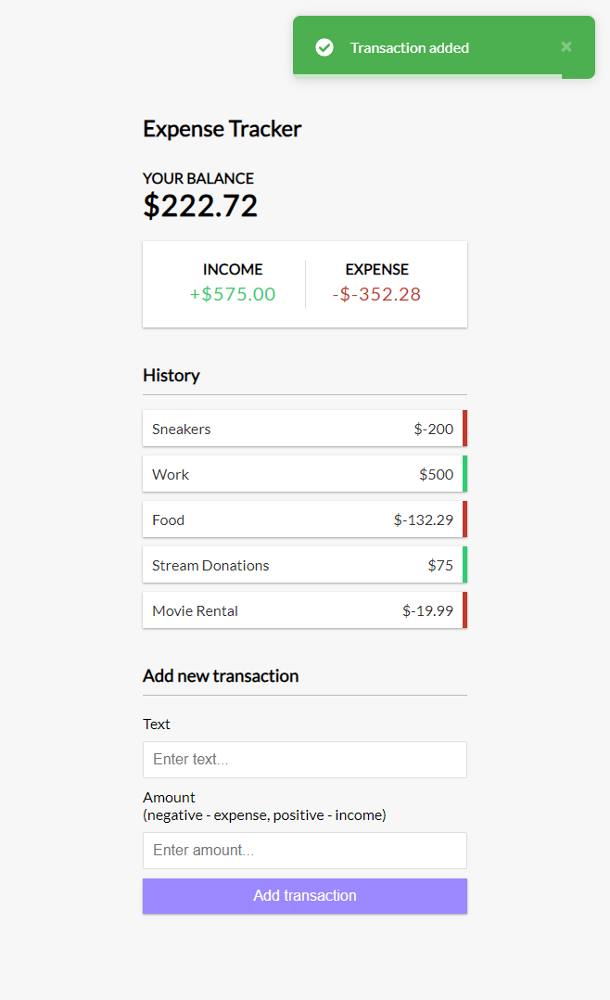

# Vue 3 Expense Tracker

An expense tracker app built with Vue 3 and the composition API.

- Add and remove expenses/income
- Track balance
- Save data to local storage
- [Vue Toastification](https://github.com/Maronato/vue-toastification) for notifications
- `<script setup>` syntax (Vue 3.2+)



## Project Setup

```sh
npm install
```

### Compile and Hot-Reload for Development

```sh
npm run dev
```

### Compile and Minify for Production

```sh
npm run build
```

#### License MIT
